# Modelling of 2D-Material based Humidity Sensor - Development of circuit to drive the Humidity Sensor #

## VLSI Design/Circuit Design ##

This project is focused on displaying the humidity value in ppm (parts per million) from a humidity sensor. The humidity sensor outputs current in micro Amperes and this has to be converted into appropriate ppm values assuming a linear function between current and humidity.

Current (micro A) | Humidity (ppm)
| :---: | :---: |
 0 | 0
 105 | 5.6

The circuit was designed in __Proteus 7 Professional__ and the code was written in __Assembly Language__. The code was comipled into an executable file via __EMU 8086__ application. The executable file was loaded into the design and the simulation was run.

Below are some of the screen shots of the circuit designed and the humidity output.

- - - -

- #### 8086 microprocessor interfacing circuit to demultiplex address and data lines ####
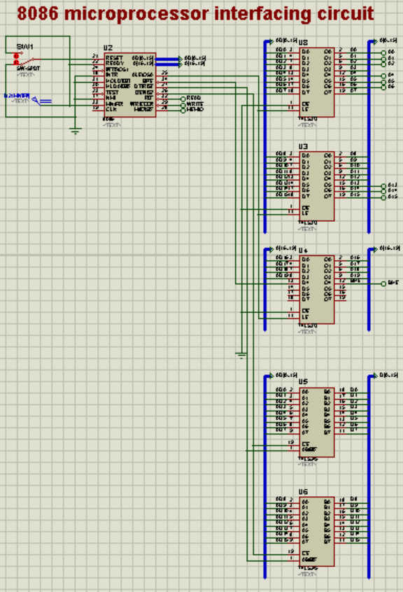
    - __8086 microprocessor__
    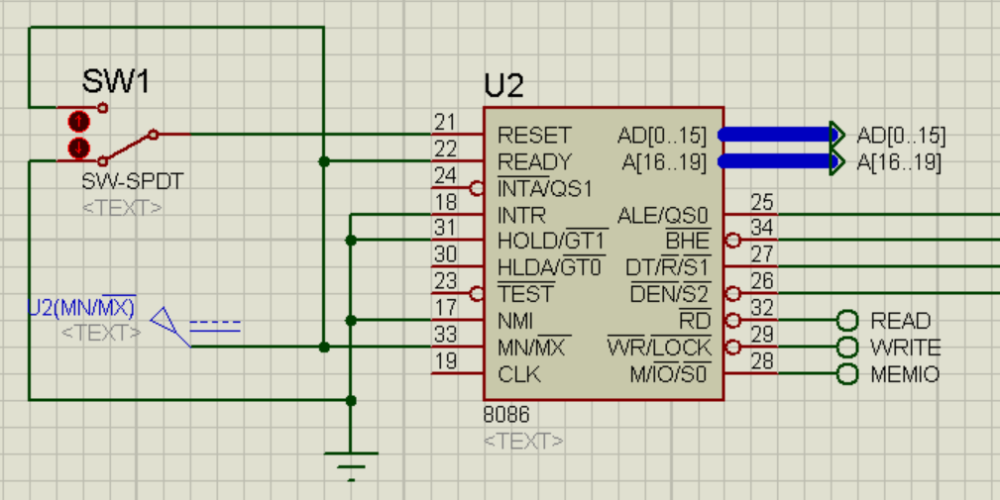
    - __74LS373 (Octal Latch) for Address de-multiplexing__
    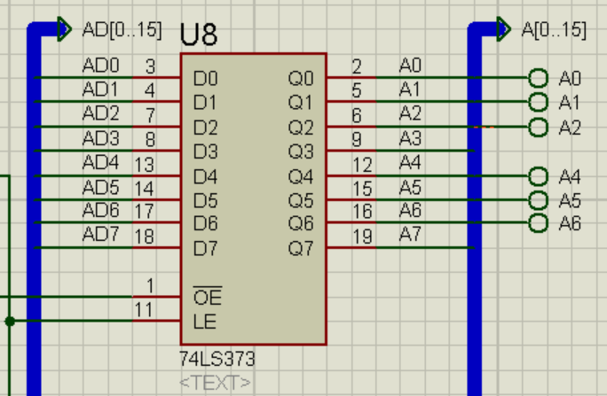
    - __74LS245 (8 bit bi-directional buffer) for Data de-multiplexing__
    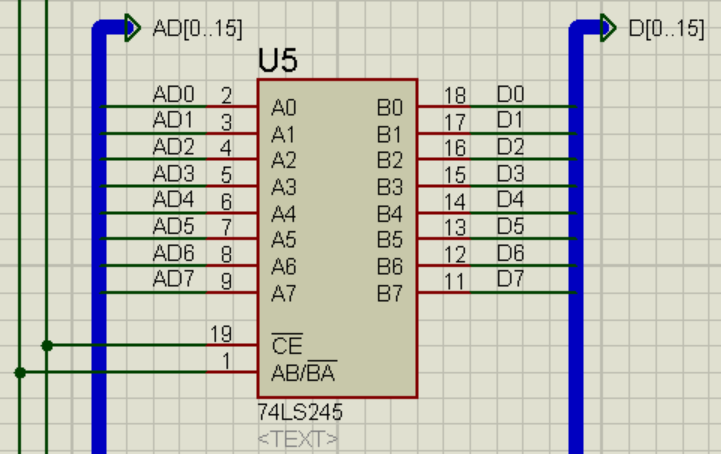

- #### Memory Interfacing along with peripheral I/O Interfacing ####
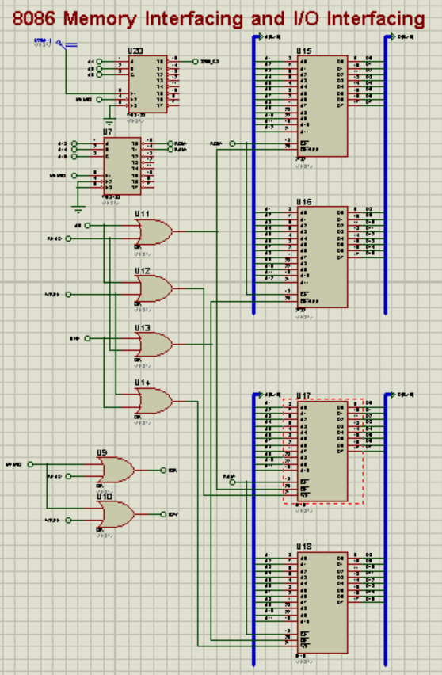
    - __ROM and RAM chip select decoding logic__
    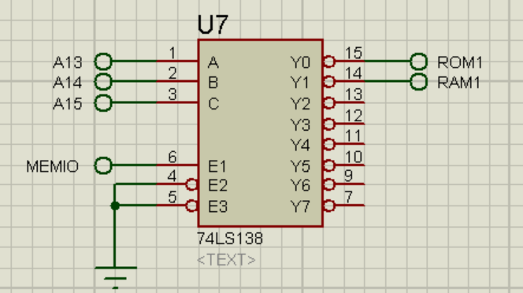
    - __READ and WRITE Enable for EVEN and ODD Banks of ROM and RAM__
    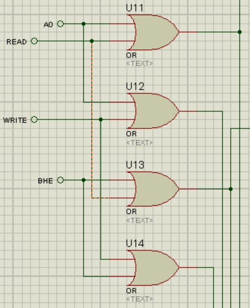
    - __4k ROM chip (2732)__
    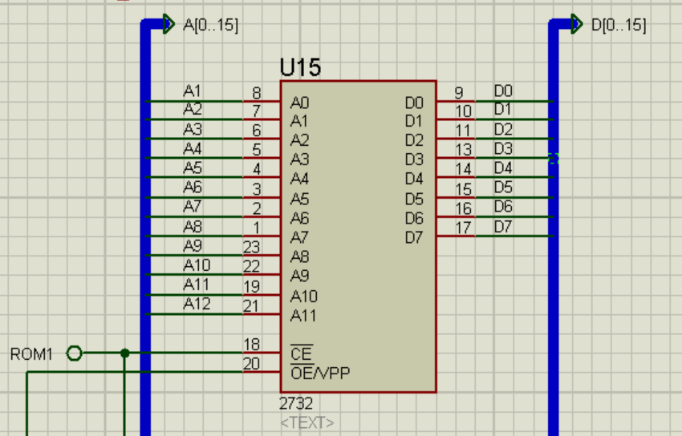
    - __2k RAM chip (6116)__
    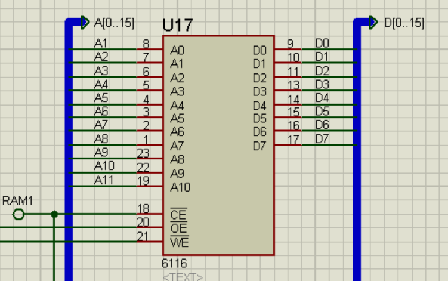
    - __IOR and IOW signals__
    
    - __8255 chip select logic (base address of 8255 = 00H)__
    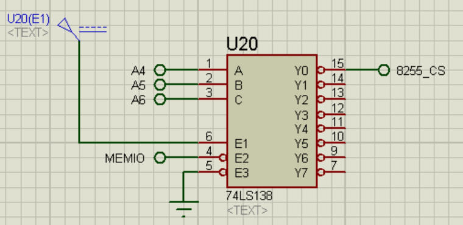

- #### 8255 PPI, Humidity output signal processing and LCD display ####
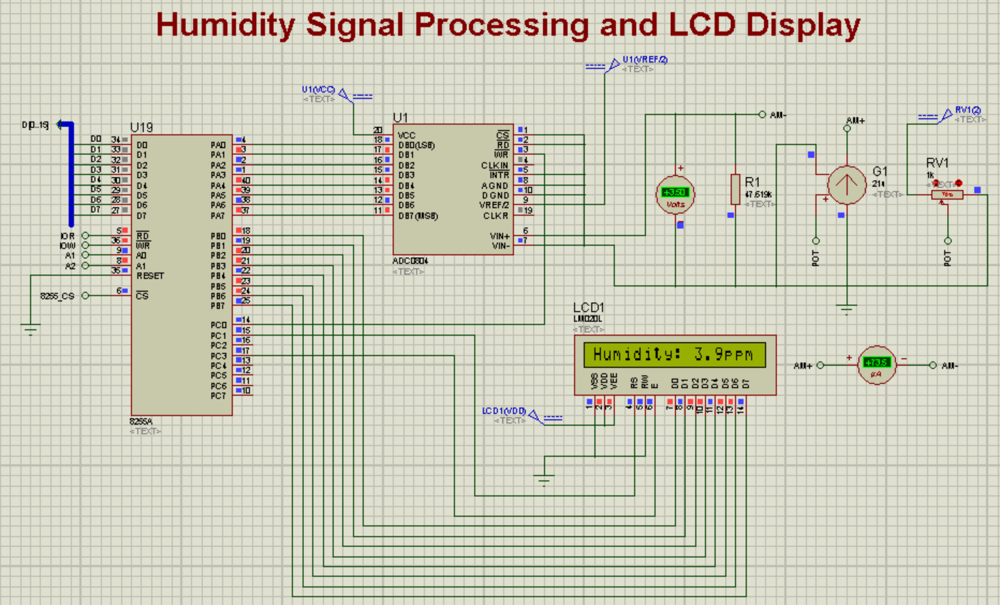
    - __8255A chip interfacing__
    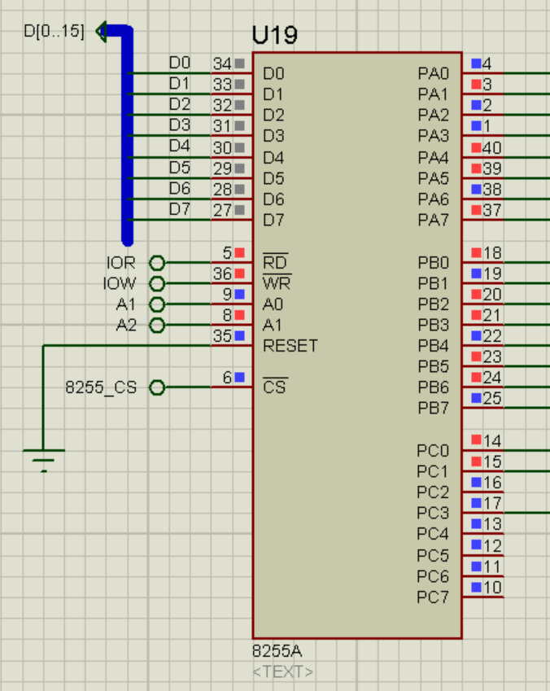
    - __Humidity sensor modelled as a VCCS (Voltage Controlled Current Source) along with a potentiometer to change output current__
    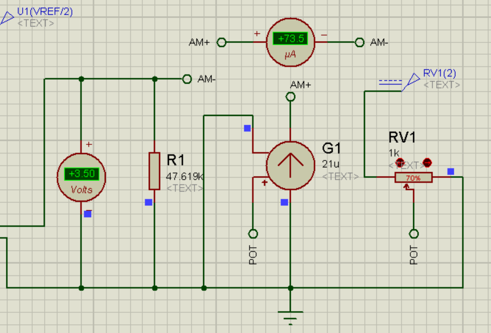
    - __ADC chip interfacing__
    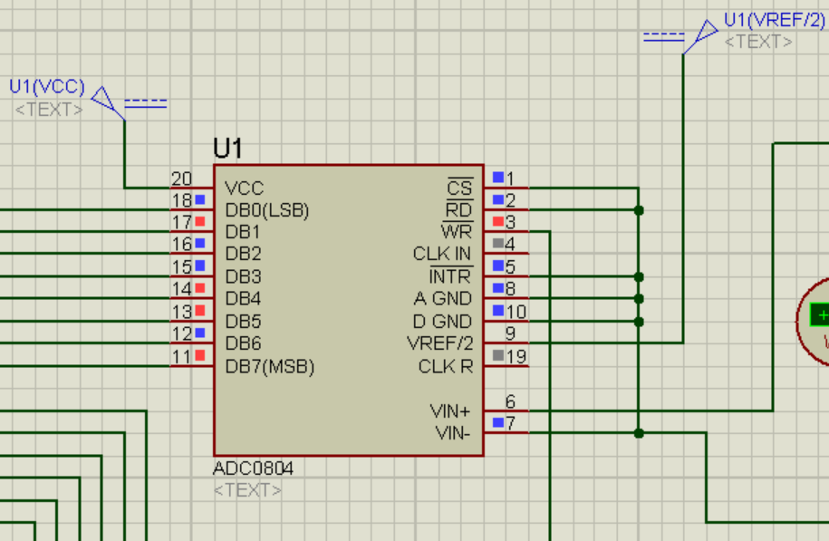
    - __LCD Output Display__
    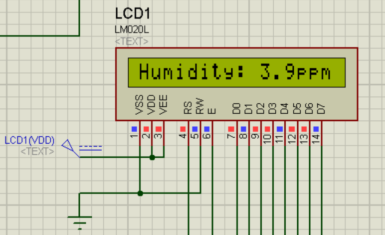
    