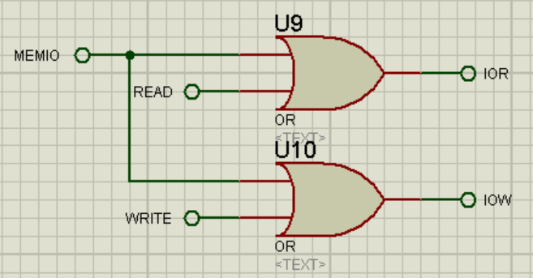

# Modelling of 2D-Material based Humidity Sensor - Development of circuit to drive the Humidity Sensor #

## VLSI Design/Circuit Design ##

This project is focused on displaying the humidity value in ppm (parts per million) from a humidity sensor. The humidity sensor outputs current in micro Amperes and this has to be converted into appropriate ppm values assuming a linear function between current and humidity.

Current (micro A) | Humidity (ppm)
| :---: | :---: |
 0 | 0
 105 | 5.6

The circuit was designed in __Proteus 7 Professional__ and the code was written in __Assembly Language__. The code was comipled into an executable file via __EMU 8086__ application. The executable file was loaded into the design and the simulation was run.

Below are some of the screen shots of the circuit designed and the humidity output.

- - - -

- ### 8086 microprocessor interfacing circuit to demultiplex address and data lines ###


   - __8086 microprocessor__
    

   - __74LS373 (Octal Latch) for Address de-multiplexing__
    

   - __74LS245 (8 bit bi-directional buffer) for Data de-multiplexing__
    

- - - -

- ### Memory Interfacing along with peripheral I/O Interfacing ###


   - __ROM and RAM chip select decoding logic__
    

   - __READ and WRITE Enable for EVEN and ODD Banks of ROM and RAM__
    

   - __4k ROM chip (2732)__
    

   - __2k RAM chip (6116)__
    

   - __IOR and IOW signals__
    
    
   - __8255 chip select logic (base address of 8255 = 00H)__
    

- - - -

- ### 8255 PPI, Humidity output signal processing and LCD display ###


   - __8255A chip interfacing__
    

   - __Humidity sensor modelled as a VCCS (Voltage Controlled Current Source) along with a potentiometer to change output current__ 
    

   - __ADC chip interfacing__
    

   - __LCD Output Display__
    

- - - -

The humidity sensor in the above circuit was modelled by a Voltage Controlled Current Source (VCCS) and the voltage was changed by using a potentiometer. This current was then passed on to a resistance of value 47.619 kOhm, which comes from the max input voltage to the ADC which is 5V and the max output current of the sensor as 105 micro Amp. The transconductance of the VCCS was also modified (21 micro Amp/V) to support 105 micro Amp current for the total length of the potentiometer. 

This output was fed to the ADC, which is a 1-channel 8 bit ADC. This ADC was controlled by the WR pin with the help of 8255 PPI controller and the output of the ADC was given as input to 8255.

8255 was operated in I/O mode along with port-A as input port while port-B and port-C as output port. The LCD display unit LM020L was connected to the port-B of 8255, and remaining control signals required for ADC and LCD display were given by port-C pins PC0, PC1, PC2, PC3.

- - - - 

The code was written in assembly language in a modular manner. The main program is at the top followed by all the procedures involved. The max ppm value that can be shown on the LCD screen was stored in a variable and it can be easily changed without affecting any other part of the program. A simple equation was used to derive the ppm value. 

The output from the ADC is in the range of 00H to FFH (0 to 255 in decimal). So for each change in the binary value, the corresponding ppm value was found out from the following equation:


Since 8086 does not support float arithmetic, all the values were converted into whole numbers (truncating decimals to 2 places and mulitplying by 100) and division was performed. 

Output of 8086 cannot occur in decimal, as ```data_type float``` is not supported by 8086. So instead the division was performed in 2 stages. 
1. In the first stage, the quotient was calculated and sent to display on LCD.
2. The remainder was taken and multiplied by 10, and a second division was performed to get the value of the first number after the decimal place. 

Since the output was supposed to be shown only till one decimal place, so a 2-stage division was sufficient.

The value on the LCD is updated in real-time, as the current value is changed, by toggling the WR pin of the ADC, and clearing and re-displaying the text after a regular interval of 40 ms (arbitrary low value).

Thank you for your patience :) and please feel free to point out any errors/give suggestions to improve the circuit.
